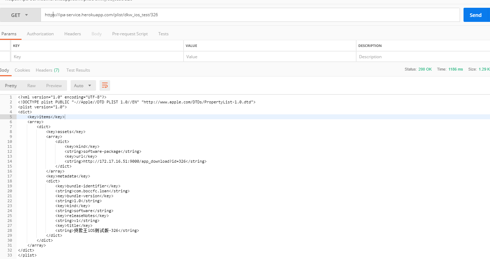

# ipa-service
提供iOS的ipa下载服务接口

主要是利用 [heroku](https://heroku.com) 提供的https 通配符域名证书解决
在实际项目中iOS测试包必须通过 https url安装的问题；



## 原理 
实现了plist接口，通过 url 参数替换[模版文件](static/dkw_ios_test.plist)实现不同版本的切换；
<name>/<id> : 模版名称/id；

根据实际需求修改模板和替换逻辑，实现自定义；

## 本地调试
### 1、clone 代码
```git clone https://github.com/beilly/ipa-service.git```

### 2、安装依赖 
- 安装 [heroku](https://devcenter.heroku.com/articles/getting-started-with-python)

- 安装python依赖：```pip install -r requirements.txt```

### 3、通过命令启动
```heroku local web -f Procfile.windows```
